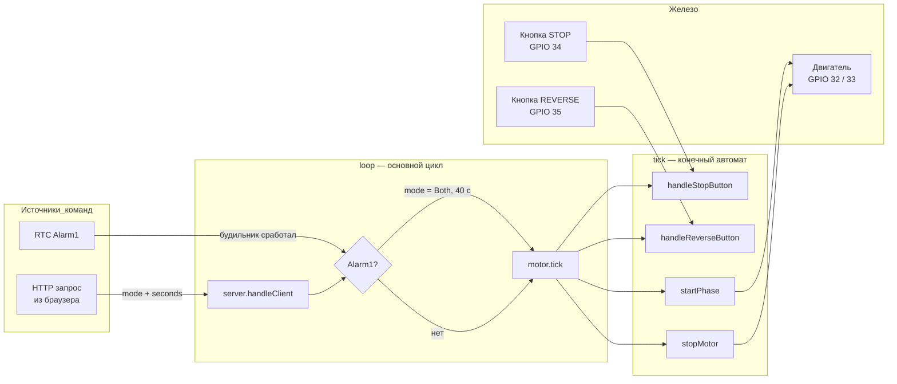
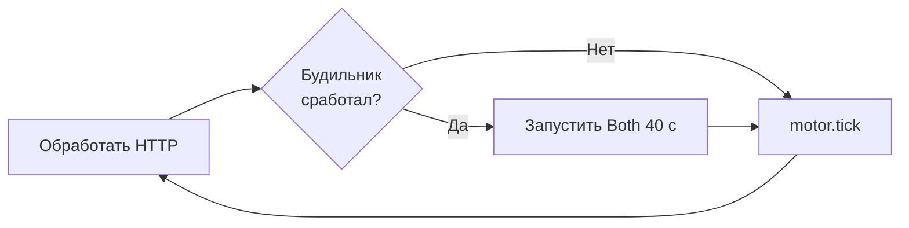
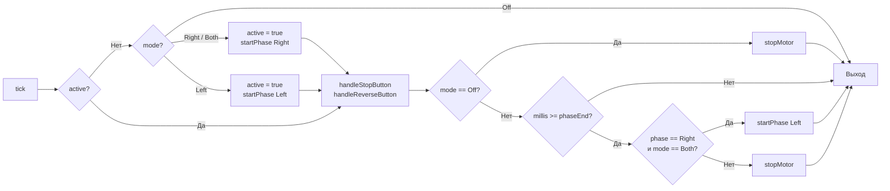
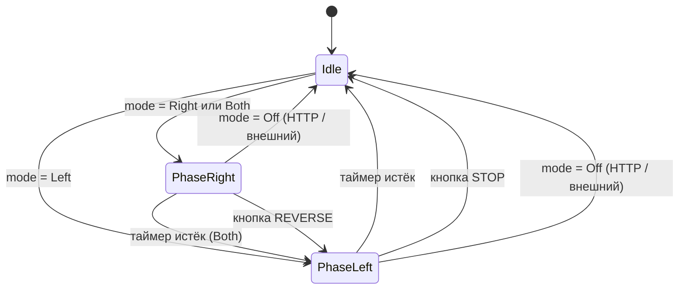

# Дозатор ESP32 — описание программы

Управление дозатором через веб-интерфейс и расписание (модуль времени RTC). Двигатель крутится без использования функции `delay()` — на основе таймера `millis() - стандартная фунция Arduino возвращающая количество миллисекунд, прошедших с момента старта микроконтроллера`.

---

## Как работает в целом

Программа состоит из трёх уровней:

1. **Периферия** — RTC DS3231 (часы + будильник), двигатель через драйвер (GPIO 32/33, PWM на GPIO 2), две физические кнопки (STOP на GPIO 34, REVERSE на GPIO 35).
2. **Сеть** — Wi-Fi в режиме STA (подключение к роутеру) или AP (своя точка доступа). HTTP-сервер на порту 80 принимает команды от пользователя из браузера.
3. **Логика** — конечный автомат `MotorState`, который на каждой итерации `loop()` через метод `tick()` проверяет состояние кнопок, таймера и переключает фазы (движение направо/налево/остановка) двигателя.

Двигатель запускается одним из двух способов:
- **По расписанию**: будильник Alarm1 в RTC срабатывает → `loop()` ставит режим работы двигателя `mode = Both (движение в прямом и обратном направлении)` с дефолтным временем работы 40 с.
- **Вручную**: пользователь через браузер вызывает HTTP-метод (`/startengine`, `/api/engine_right`, `/api/engine_left`) → обработчик ставит нужный  режим `(mode)` и  время работы двигателя `(engineWorkTime)`.

После установки `mode` метод `tick()` на следующей итерации подхватывает его и запускает двигатель. Весь цикл неблокирующий — время фазы отсчитывается через `millis()`, функция `delay()` не используется.

---

## Запуск (`setup`)

1. Инициализация RTC, пинов, двигателя
2. Чтение Wi-Fi логина/пароля из энергонезависимой памяти (NVS)
3. Подключение к роутеру (STA). Если не вышло за 15 с — поднять свою точку доступа (AP)
4. Запуск HTTP-сервера на порту 80

---

## Основной цикл (`loop`)

---

## Режимы двигателя

| Режим | Поведение |
|---|---|
| `Right` | Вправо N секунд → стоп |
| `Left` | Влево N секунд → стоп |
| `Both` | Вправо N с → влево N с → стоп |
| `Off` | Выключен |

---

## Структура `MotorState`

Хранит полное состояние двигателя и реализует всю логику управления им.

**Поля:**

| Поле | Тип | Описание |
|---|---|---|
| `mode` | `MotorMode` | Целевой режим; устанавливается извне (HTTP, будильник) |
| `engineWorkTime` | `int` | Длительность одной фазы, секунды (по умолчанию 40) |
| `active` | `bool` | `true`, пока выполняется хотя бы одна фаза |
| `phase` | `MotorMode` | Текущая активная фаза: `Right` или `Left` |
| `phaseEnd` | `unsigned long` | Момент окончания фазы в `millis()` |
| `pin1`, `pin2` | `uint8_t` | Пины направления вращения |

**Методы:**

| Метод | Описание |
|---|---|
| `init(p1, p2)` | Привязывает пины к структуре; вызывается один раз в `setup()` |
| `isRight/Left/Both/Off()` | Предикаты проверки текущего `mode` |
| `toInt() / fromInt(v)` | Сериализация `mode` в `uint8_t` и обратно |
| `startPhase(ph)` | Выставляет пины по направлению и задаёт `phaseEnd` |
| `stopMotor()` | Обнуляет пины, переводит `mode = Off`, сбрасывает `active` |
| `debounce(last)` | Антидребезг: `true`, если прошло ≥ `debounceMs` с последнего вызова |
| `handleStopButton()` | Кнопка STOP в фазе Left → `mode = Off` |
| `handleReverseButton()` | Кнопка REVERSE в фазе Right → досрочный `startPhase(Left)` |
| `tick()` | Неблокирующий шаг конечного автомата; вызывается каждую итерацию `loop()` |

## Логика `tick()`

Метод вызывается каждую итерацию `loop()` и работает в четыре этапа:

### 1. Запуск (если двигатель не активен)

Если `active == false` и `mode` отличается от `Off`, метод стартует первую фазу:
- `Right` или `Both` → `startPhase(Right)` (вправо)
- `Left` → `startPhase(Left)` (влево)

После этого `active = true`. Если `mode == Off` — ничего не происходит, метод завершается.

### 2. Обработка кнопок

При активном двигателе на каждой итерации проверяются две кнопки:
- **STOP** (GPIO 34) — срабатывает только в фазе Left. Ставит `mode = Off`, что приведёт к остановке на шаге 3.
- **REVERSE** (GPIO 35) — срабатывает только в фазе Right. Досрочно переключает на фазу Left через `startPhase(Left)`.

Обе кнопки защищены антидребезгом (`debounceMs = 80 мс`).

### 3. Внешний стоп

Если к этому моменту `mode == Off` (установлен кнопкой STOP, HTTP-запросом или другой логикой), вызывается `stopMotor()` — пины обнуляются, `active` сбрасывается. Двигатель останавливается немедленно.

### 4. Переход по таймеру

Если `mode` не `Off`, но время фазы истекло (`millis() >= phaseEnd`):
- Фаза `Right` при режиме `Both` → переход на фазу Left через `startPhase(Left)` с новым `phaseEnd`.
- Любой другой случай → `stopMotor()`. Это финальная остановка: одиночная фаза `Right`/`Left` завершена, или вторая фаза `Both` (Left) закончилась.

### Блок-схема

### Диаграмма состояний

---

## HTTP API

| Эндпоинт | Параметры | Что делает |
|---|---|---|
| `GET /` | — | Веб-интерфейс |
| `GET /startengine` | — | Запустить Both (40 с) |
| `GET /api/engine_right` | `seconds` 1–40 | Вправо N секунд |
| `GET /api/engine_left` | `seconds` 1–40 | Влево N секунд |
| `GET /api/settime` | `text=hh:mm` | Текущее время RTC |
| `GET /api/setalarmtime` | `text=hh:mm` | Время будильника |
| `GET /api/setwifi` | `ssid`, `pass` | Сохранить Wi-Fi, перезагрузить |

---

## Wi-Fi

- При старте читает SSID/пароль из NVS
- Первый запуск: записывает дефолты `dozator` / `adminadmin`
- Если роутер недоступен — поднимает AP `ESP32` / `12345678` по адресу `192.168.1.1`
- Смена Wi-Fi через `/api/setwifi` → сохранение в NVS → перезагрузка
